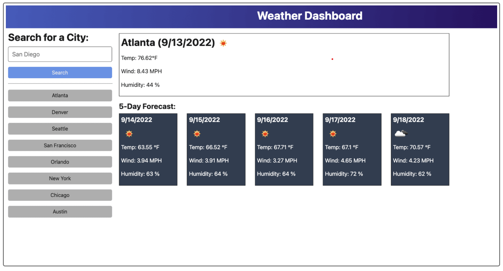

# weather-dashboard
This dashboard will show the current weather as well as the 5-day forecast for the city the user chooses.

## Description
The weather dashboard will accept a city as input. When the user clicks the Search button, the city's current weather will display, along with a 5-Day forecast. That city will be added to a list of past searches so that the user can click on a past search to bring up that city's weather again.

## User Story
AS A traveler

I WANT to see the weather outlook for multiple cities

SO THAT I can plan a trip accordingly

### Acceptance Criteria
GIVEN a weather dashboard with form inputs

WHEN I search for a city

THEN I am presented with current and future conditions for that city and that city is added to the search history

WHEN I view current weather conditions for that city

THEN I am presented with the city name, the date, an icon representation of weather conditions, the temperature, the humidity, and the the wind speed

WHEN I view future weather conditions for that city

THEN I am presented with a 5-day forecast that displays the date, an icon representation of weather conditions, the 
temperature, the wind speed, and the humidity

WHEN I click on a city in the search history

THEN I am again presented with current and future conditions for that city

### Mock Up
Screen shot of the main page:

## Installation/Execution
https://vdunlop.github.io/weather-dashboard

Execute by going to the above URL. You will be brought to a screen with an input box and Search button.

Enter the city, state (abbreviated) that you would like to see weather information on.

Your search will be saved in a list below the Search button.

The current weather will be displayed in a box on the right side of the screen.

The 5-Day forecast will be displayed below the current weather.

At this time, the user can click on one of the existing cities that have been searched for, or can enter a new search.

## Usage
The Weather Dashboard can be used for several purposes:

1. An easy way to look up the weather for a city. You will receive current weather and a 5-Day forecast.

2. An easy way to look up the weather for several cities. By searching for a city, you will see the current weather and 5-Day forecast, and then be able to click on past cities that you have searched for. This makes for an easy way to compare weather in many cities if, for example, you are scheduling a trip and want to know what order to visit the sites in.

## Credits

Office hours with Byron to learn how to daisychain API fetches.

## License

N/A